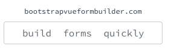
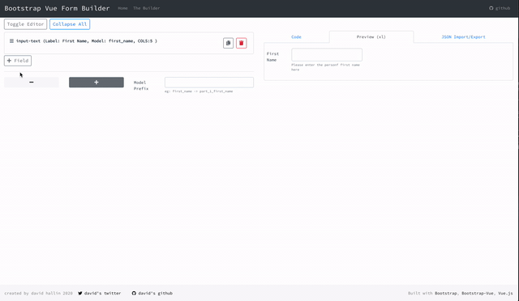
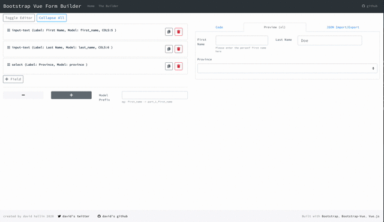
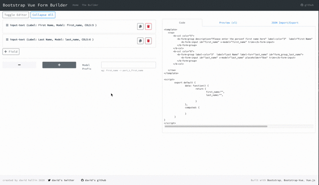
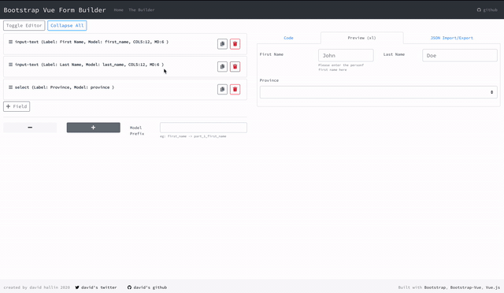
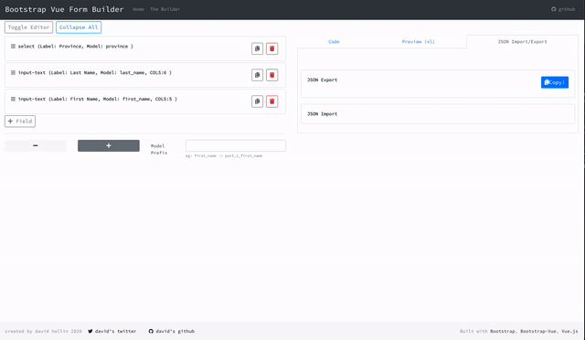

[](https://circleci.com/gh/hallindavid/BootstrapVueFormBuilder/tree/master)

<center><h1>Bootstrap Vue Form Builder</h1>
</center><br />

## Project Archived.  I did not keep up with the latest version of Vue, or Bootstrap Vue for that matter.

Sorry all.

## Demos (<a href="https://hallindavid.github.io/BootstrapVueFormBuilder/#/builder">Production Deployment</a>)
Quickly scaffold BootstrapVue form components and preview them in real time

<center></center>

Organize your form with drag and drop ease (using vue-slicksort)

<center></center>

Generate the code in real-time

<center></center>

Ensure responsiveness by collapsing the editor and testing with different breakpoints

<center></center>

Nothing is stored on the server, so you can save/restore your forms with JSON code (I have no idea how scalable this is, but I haven't had an issue yet!)

<center></center>

## The Vision
<p>I think that most of the code for forms is repeatable, so if this does 80% of the work, you use IDE snippets for another 15% and you manually clean up that last 5% I'd call that a win</p>


## Built With
* <a href="https://bootstrap-vue.js.org/" target="_blank()">Bootstrap Vue</a>
* <a href="https://vuejs.org/" target="_blank()">Vue.js</a>
* <a href="https://vuejs.org/" target="_blank()">Bootstrap</a>
* <a href="https://fontawesome.com/" target="_blank()"> Font Awesome</a>
* <a href="https://github.com/Inndy/vue-clipboard2" target="_blank()">Vue Clipboard 2</a>
* <a href="https://github.com/Jexordexan/vue-slicksort" target="_blank()">vue-slicksort</a>
* <a href="https://github.com/nicolasbeauvais/vue-social-sharing" target="_blank()">vue-social-sharing</a>


## Support
To say thanks, you can share the project on social media or <br />

<a href="https://www.buymeacoffee.com/tDbQ4kg" target="_blank"></a>


## Issues
Please report all issues in the GitHub Issue tracker

## Contributing
Shoot me an email, or DM me on twitter and I am happy to allow other contributors.

### Project setup
Clone it, then run
```
npm install
```

#### Compiles and hot-reloads for development
```
npm run serve
```

#### Compiles and minifies for production
```
npm run build
```

#### Lints and fixes files
```
npm run lint
```

